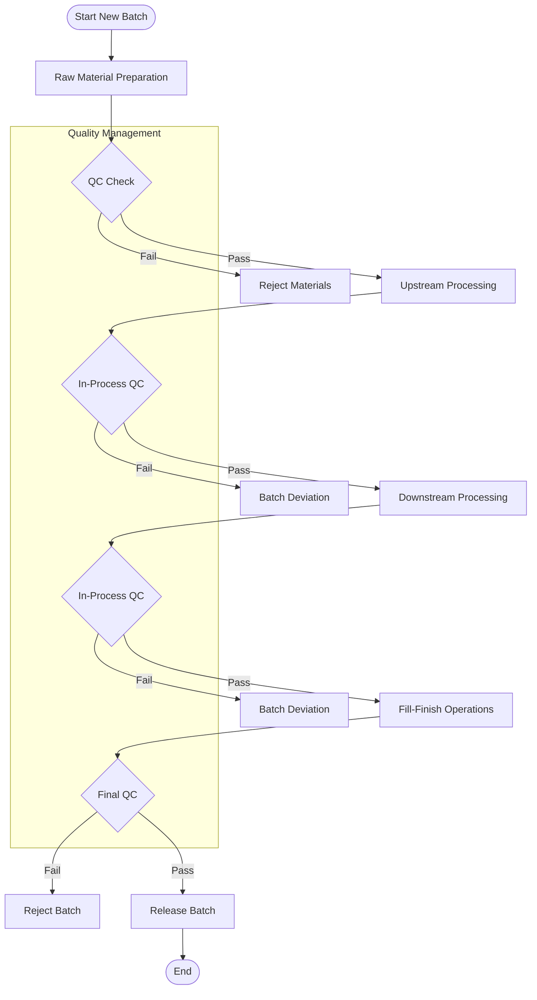
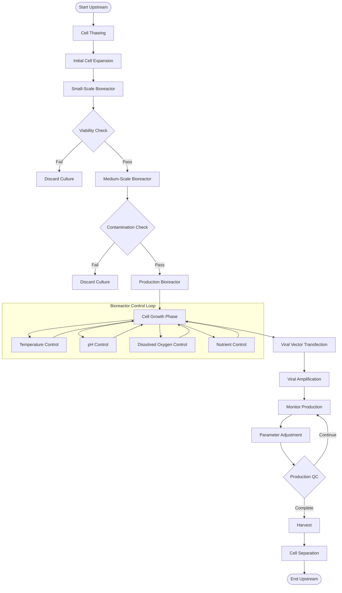
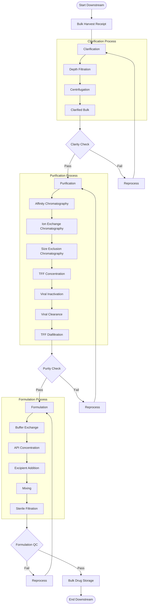
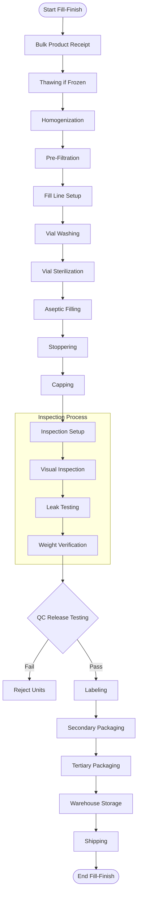
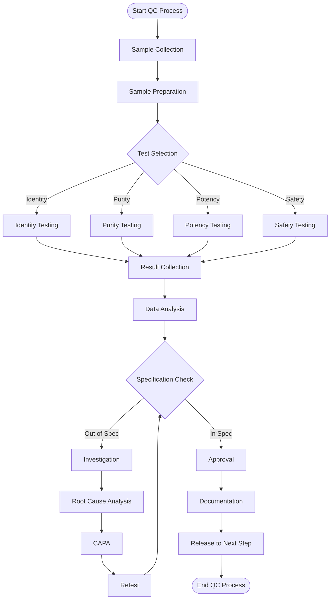
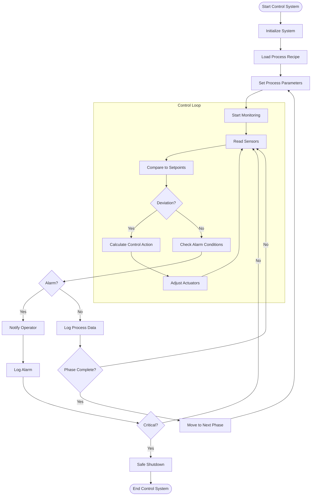
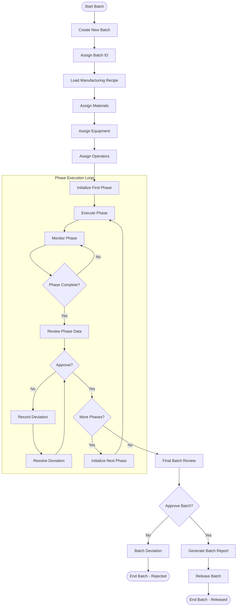
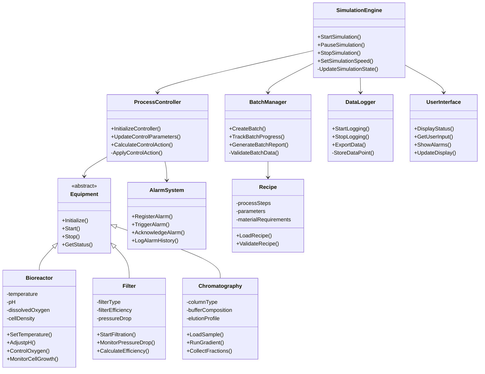

# Pharmaceutical Process Flow Diagrams

This document contains all the process flow diagrams for the PharmaVax Pharmaceutical Process Automation System.

## Table of Contents
1. [Overall Manufacturing Process Flow](#overall-manufacturing-process-flow)
2. [Upstream Processing Flow](#upstream-processing-flow)
3. [Downstream Processing Flow](#downstream-processing-flow)
4. [Fill-Finish Operations Flow](#fill-finish-operations-flow)
5. [Quality Control Process Flow](#quality-control-process-flow)
6. [Control System Flow](#control-system-flow)
7. [Batch Management Flow](#batch-management-flow)
8. [System Architecture Diagram](#system-architecture-diagram)

## Overall Manufacturing Process Flow

## Upstream Processing Flow

## Downstream Processing Flow

## Fill-Finish Operations Flow

## Quality Control Process Flow

## Control System Flow

## Batch Management Flow

## System Architecture Diagram

